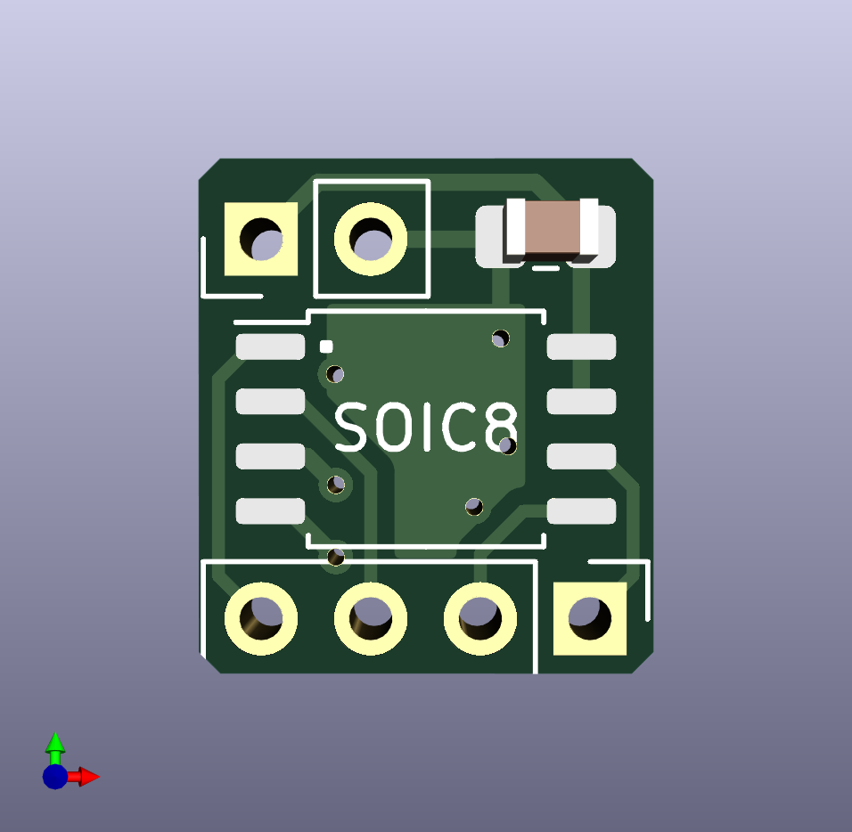
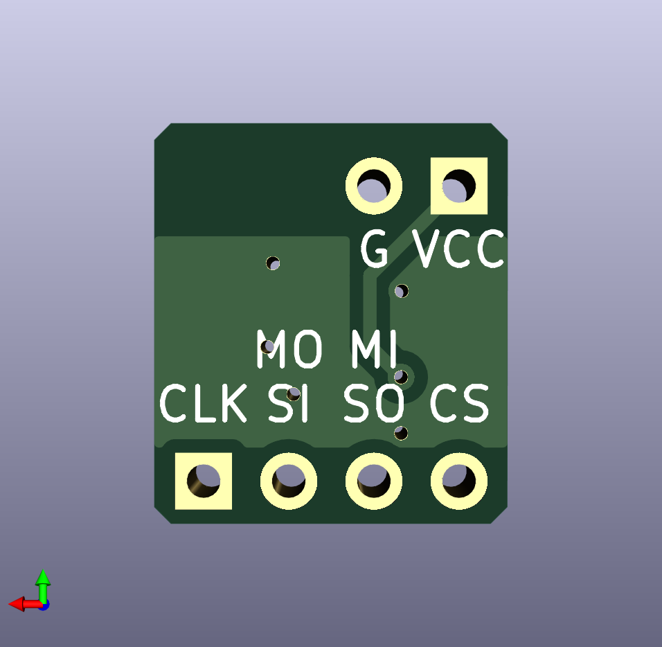
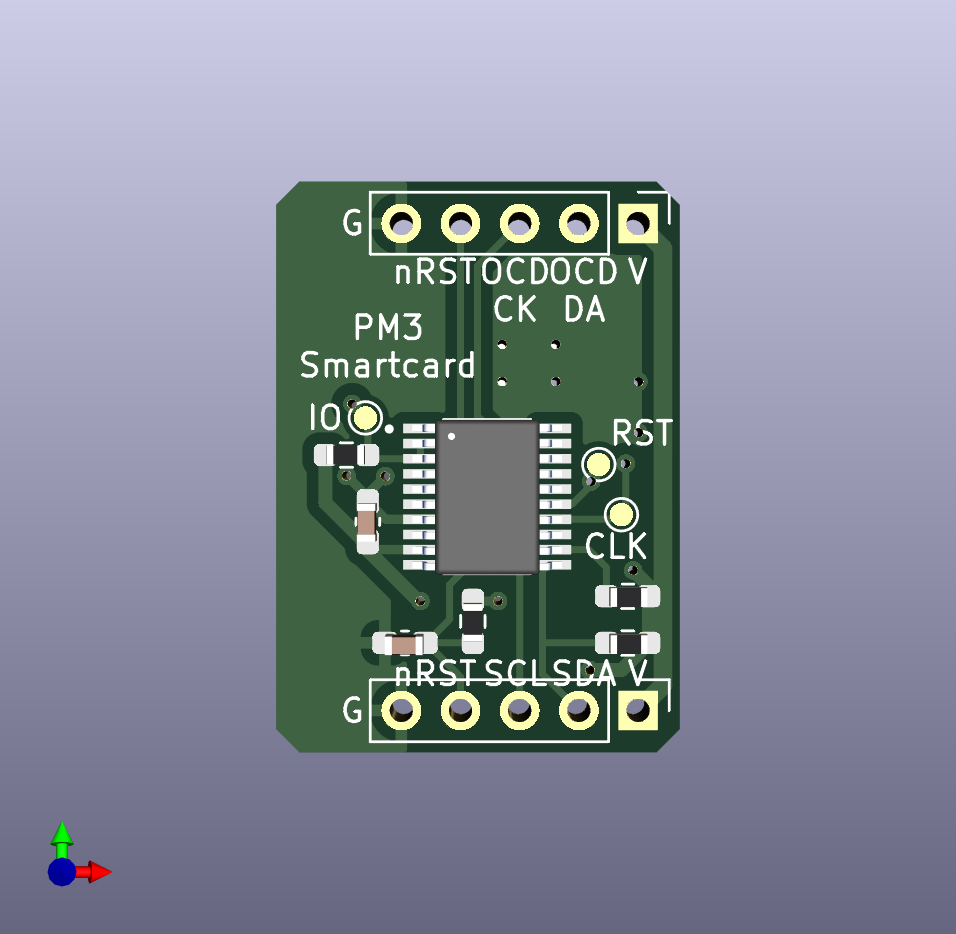
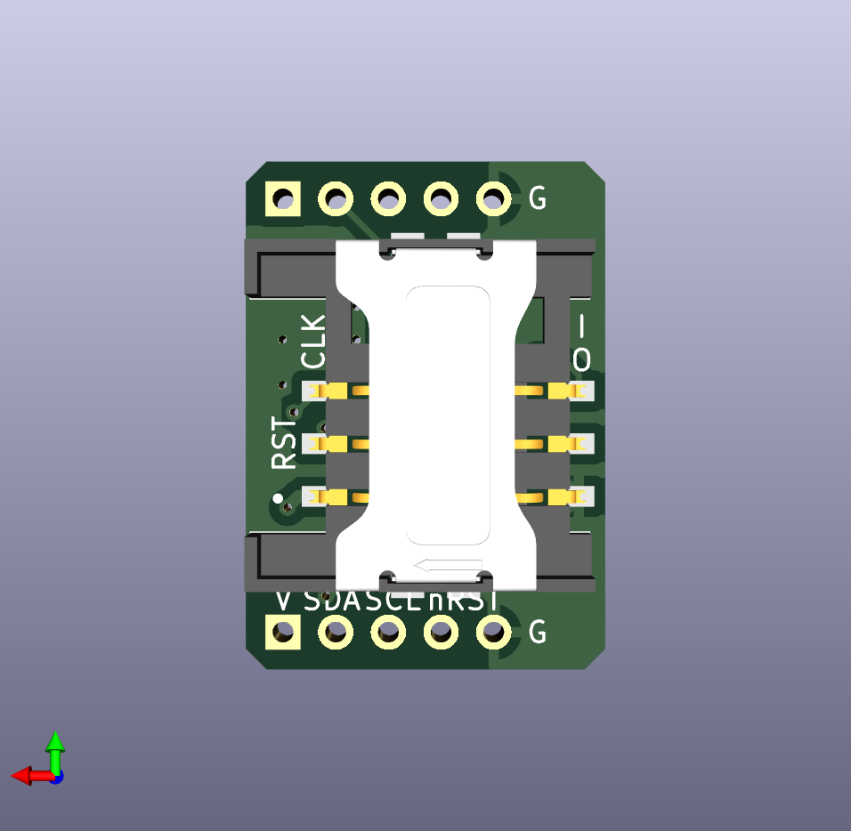

# PM3 Modding

## PM3_Flash
Add the external SPI flash to the PM3 Easy  
[README](/PM3_Flash/README.md)  
[Schematic](./PM3_Flash/hardware/PM3_Flash-schematic.pdf)  
    

## PM3_ISO7816
Add the smartcard module to the PM3 Easy  
[README](/PM3_ISO7816/README.md)  
[Schematic](./PM3_ISO7816/hardware/PM3_ISO7816-schematic.pdf)  
    

## PM3_USB2TCP
[README](/PM3_USB2TCP/README.md)  
Connect to PM3 hardware with TCP, using ESP32-S3 as a USB to TCP bridge  
No need to jumping any wires to the MCU directly. It works with most of the ESP32-S3 dev boards  

## License
All hardware projects in this repository are licensed under [CERN Open Hardware Licence Version 2 - Weakly Reciprocal](LICENSE.CERN-OHL-W).  
All software(firmware) projects in this repository are licensed under [GNU General Public License v3.0](LICENSE.GPL).  
